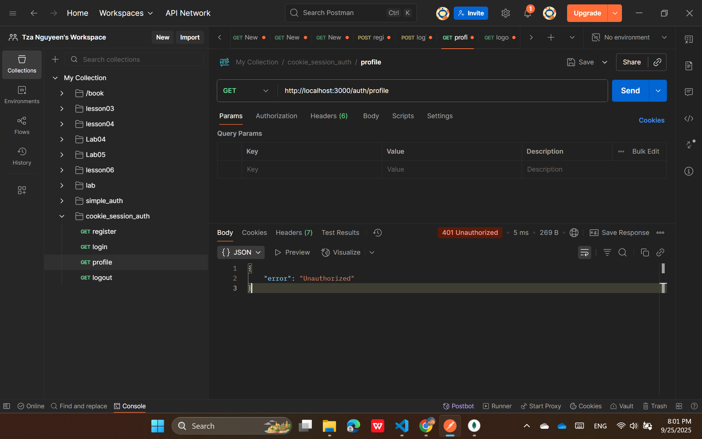
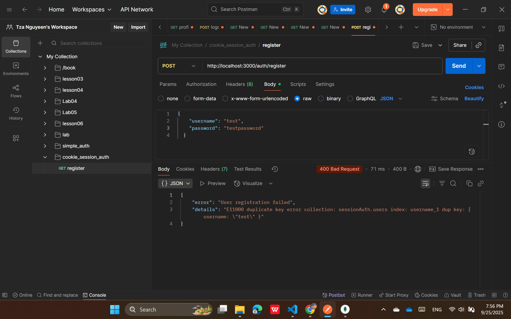
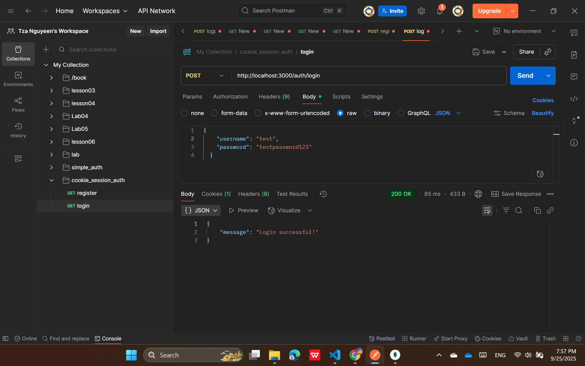
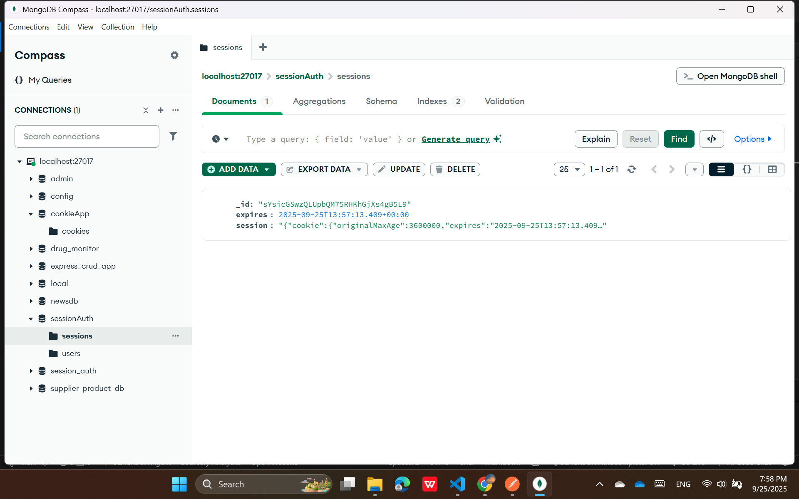
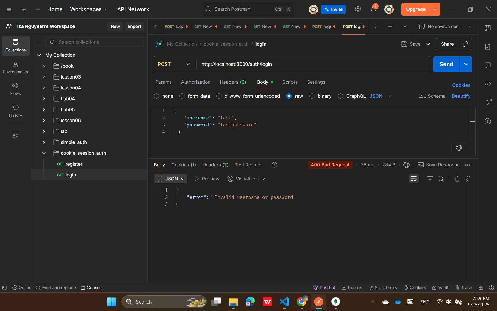
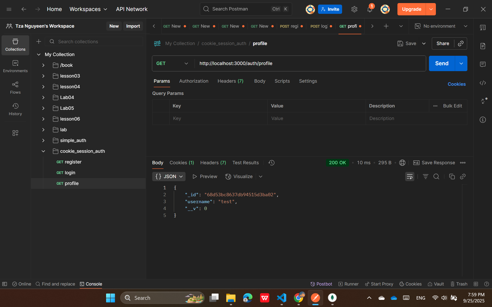
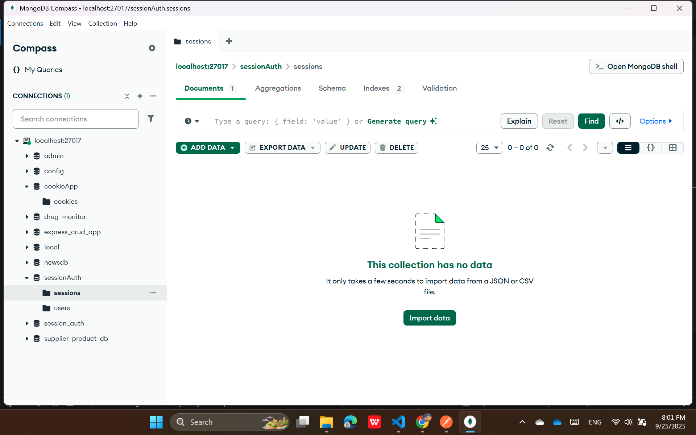

## Cookie Session Authentication Testing

### Cài đặt và khởi chạy

```bash
cd src/cookie_session_auth
npm install
node app.js
``

Server sẽ chạy tại: `http://localhost:3000`

### API Endpoints

| Method | Endpoint | Mô tả |
|--------|----------|--------|
| POST | `/auth/register` | Đăng ký người dùng mới |
| POST | `/auth/login` | Đăng nhập |
| GET | `/auth/profile` | Xem thông tin cá nhân (cần đăng nhập) |
| GET | `/auth/logout` | Đăng xuất |

---

## Hướng dẫn Test bằng Postman

### 1. 📝 Register (Đăng ký)

**Request Configuration:**
- **Method:** `POST`
- **URL:** `http://localhost:3000/auth/register`
- **Body (raw JSON):**
  ```json
  {
    "username": "testuser",
    "password": "testpassword123"
  }
  ```

**Expected Response (200 OK):**
```json
{
  "message": "User registered successfully!"
}
```

**Error Response (400 Bad Request):**
```json
{
  "error": "User registration failed",
  "details": "Username already exists"
}
```

---

### 2. 🔐 Login (Đăng nhập)

**Request Configuration:**
- **Method:** `POST`
- **URL:** `http://localhost:3000/auth/login`

- **Body (raw JSON):**
  ```json
  {
    "username": "testuser",
    "password": "testpassword123"
  }
  ```

**Expected Response (200 OK):**
```json
{
  "message": "Login successful!"
}
```


## In MongoDB


**⚠️ Quan trọng:** Sau khi login thành công:
- Postman sẽ tự động lưu session cookie `connect.sid`
- Kiểm tra tab **"Cookies"** để xem cookie đã được set
- Cookie này sẽ được gửi tự động trong các request tiếp theo

**Error Response (400 Bad Request):**
```json
{
  "error": "Invalid username or password"
}
```

---

### 3. 👤 Profile (Thông tin cá nhân - Protected Route)

**Request Configuration:**
- **Method:** `GET`
- **URL:** `http://localhost:3000/auth/profile`

**Expected Response (200 OK) - Khi đã đăng nhập:**
```json
{
    "_id": "68d53bc8637db94515d3ba02",
    "username": "test",
    "__v": 0
}
```

**Error Response (401 Unauthorized) - Khi chưa đăng nhập:**
```json
{
  "error": "Unauthorized"
}
```

---

### 4. 🚪 Logout (Đăng xuất)

**Request Configuration:**
- **Method:** `GET`
- **URL:** `http://localhost:3000/auth/logout`

**Expected Response (200 OK):**
```json
{
  "message": "Logout successful!"
}
```


**Sau khi logout:**
- Session cookie sẽ bị xóa
- Các request tiếp theo đến protected routes sẽ bị từ chối


---

## 🧪 Test Cases Scenarios

### Scenario 1: Happy Path (Flow hoàn chỉnh)
1. **Register** → User được tạo thành công
2. **Login** → Nhận được session cookie
3. **Profile** → Xem được thông tin user
4. **Logout** → Session bị hủy
5. **Profile** → Nhận lỗi "Unauthorized"

### Scenario 2: Error Handling
1. **Register với username trùng** → Error 400
2. **Login với thông tin sai** → Error 400
3. **Access Profile khi chưa login** → Error 401
4. **Register với dữ liệu thiếu** → Error 400

### Scenario 3: Edge Cases
1. **Login nhiều lần** → Session được cập nhật
2. **Logout khi chưa login** → Vẫn trả về success
3. **Request với cookie không hợp lệ** → Error 401

---


---

## 📊 Expected Results Summary

| Action | Status Code | Cookie Status | Access to Profile |
|--------|-------------|---------------|-------------------|
| Register | 200 | No cookie | ❌ Unauthorized |
| Login | 200 | Cookie set | ✅ Authorized |
| Profile (After Login) | 200 | Cookie exists | ✅ Authorized |
| Logout | 200 | Cookie cleared | ❌ Unauthorized |
| Profile (After Logout) | 401 | No cookie | ❌ Unauthorized |

---

## 🐛 Common Issues & Solutions

### Issue 1: "Cannot find module 'express'"
**Solution:**
```bash
cd src/cookie_session_auth
npm install
```

### Issue 2: MongoDB Connection Error
**Solution:**
- Đảm bảo MongoDB đang chạy
- Kiểm tra connection string trong `app.js`

### Issue 3: Cookie không được set
**Solution:**
- Kiểm tra Postman settings
- Đảm bảo "Send cookies automatically" được bật

### Issue 4: Session không persist
**Solution:**
- Kiểm tra express-session configuration
- Verify MongoDB connection cho session store

---

## 📝 Notes

- Session cookies có thời gian sống mặc định
- Cookie name mặc định là `connect.sid`
- Server phải được khởi động trước khi test
- Đảm bảo MongoDB đang chạy cho session persistence

---

